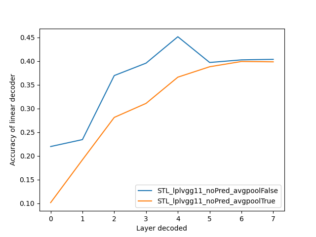
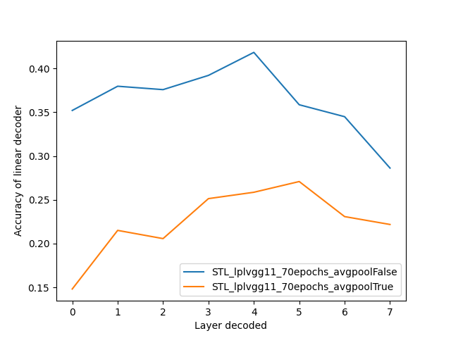

# LPL

This code is an unofficial implementation of the paper

> Halvagal, M. S., & Zenke, F. (2022). The combination of Hebbian and predictive plasticity learns invariant object representations in deep sensory networks. bioRxiv.

currently, the predictive loss does not seem to work. It seems that the results without predictive loss
(relying on Hebbian plasticity alone) are qualitatively similar (top accuracies ~40%), although still not
exactly the same.

This is the result without predictive loss:


and this is with predictive loss:



## Usage
1. Install requirements: `pip install -r requirements.txt`.

2. You can train a network using `train_vgg.py` (parameters are currently to be changed within the file).
A pretrained network (without using the predictive loss) can be found in the models folder.

3. You can then train a decoder from each layer of the trained network with
```python linear_train.py --name models/<model>.pth --avgpool```
where `avgpool` applies global average pooling before the decoder.

4. Then, the result can be plotted with
```python make_figure.py reports/*```
which will create a PNG image in `figures`.

## Tests
I wrote a few tests to check that the deltas found by autograd are the same reported on the paper.
A couple of observations:
- There's a factor of 2 missing in the Hebbian loss and a factor of 4 in the Decorrelation loss,
this should not really affect the result, except that the lambdas may be slightly different.
- I noticed the Predictive loss is extensive (the value depends on batch size), while
the other two are not.

To run tests, simply run `pytest`.

Additionally, you can visually check the effect of the image augmentations using
the notebook `show-image-transformations.ipynb`.
